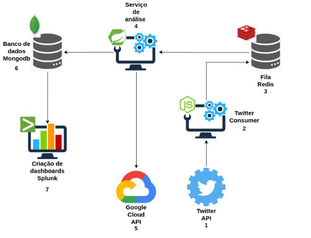

# twitter-analysis-service

*Descrição:* Sistema desenvolvido como parte de um trabalho de conclusão de curso de Engenharia de Software.

Aluno: Igor Costa de Oliveira Obeica

Orientador: Daves Marcio Silva Martins

Centro Universitário Academia - Uniacademia / Juiz de Fora

Este serviço tem o objetivo de realizar a análise de sentimentos de comentários do Twitter e salvar em um banco de dados para futuras análises.

---
### Pré-requisitos:
- JDK 11+
- Maven 3+

---

### Fluxo dos sistemas:
Esse serviço deve ser executado em conjunto com o [*serviço consumidor do Twitter*](https://github.com/IgorCooli/twitter-consumer).

---

### Endpoints:
`URL_SISTEMA/tweet/execute` -> Retorna todos os tweets já analisados

`URL_SISTEMA/text?text={texto para análise}` -> Realiza a análise de sentimentos em uma frase

---

### Variáveis de ambiente

| Chave  | Valor |
| ------------- | ------------- |
| GOOGLE_APPLICATION_CREDENTIALS  | {Path do GCloud Credentials}  |
| MONGO_DB_NAME  | {MongoDB Name}  |
| MONGO_PASS  | {MongoDB Password}  |
| MONGO_PORT  | {MongoDB Port}  |
| MONGO_URL  | {MongoDB URL}  |
| MONGO_USER  | {MongoDB User}  |
| REDIS_PASS  | {Redis Password}  |
| REDIS_PORT  | {Redis Port}  |
| REDIS_URL  | {Redis URL}  |

---

#### Desenvolvido por:
- Igor Oliveira [*#Github*](https://github.com/IgorCooli) [*#Linkedin*](https://www.linkedin.com/in/igor-obeica/)
